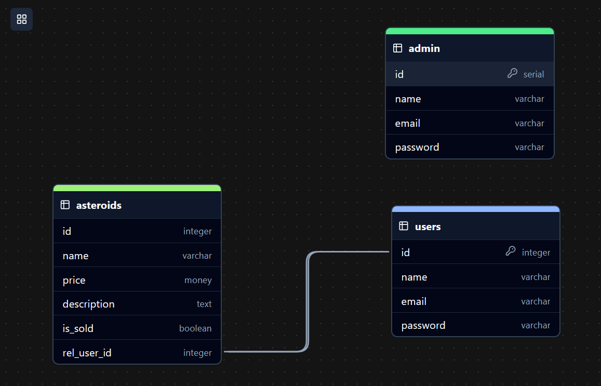

## Instruções para rodar o projeto (local)

1. Renomear .env.example para .env
2. Gerar key de API's da [nasa](https://api.nasa.gov/)

## Diagrama ER



## Backlog:
[Documentação do Projeto](https://docs.google.com/document/d/1fW03JubXT7jkzEh2gjQOhclCAqpgh0n3a5EOPSYwfhc/edit?tab=t.0#heading=h.6ry6j2te4t2e)


Seguiremos o guia de commits semânticos, que diz:

## Mensagens de Commit Semânticas

Veja como uma pequena mudança no estilo da sua mensagem de commit pode fazer de você um programador melhor.

Formato: `<tipo>(<escopo>): <assunto>`

`<escopo>` é opcional

### Exemplo

```
feat: adicionar oscilação ao chapéu
^--^  ^-------------------------^
|     |
|     +-> Resumo no presente.
|
+-------> Tipo: chore, docs, feat, fix, refactor, style, ou test.
```

Mais Exemplos:

- `feat`: (nova funcionalidade para o usuário, não uma nova funcionalidade para o script de build)
- `fix`: (correção de bug para o usuário, não uma correção para um script de build)
- `docs`: (mudanças na documentação)
- `style`: (formatação, falta de ponto e vírgula, etc; nenhuma mudança no código de produção)
- `refactor`: (refatoração do código de produção, ex. renomear uma variável)
- `test`: (adicionar testes faltantes, refatorar testes; nenhuma mudança no código de produção)
- `chore`: (atualização de tarefas do grunt etc; nenhuma mudança no código de produção)
- `perf`: (atualização que melhore a performance)
